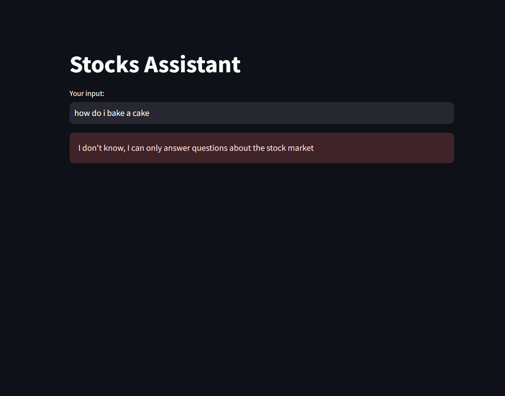
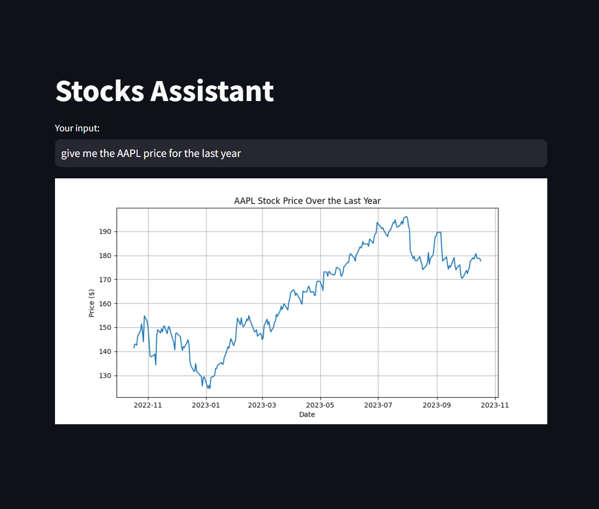
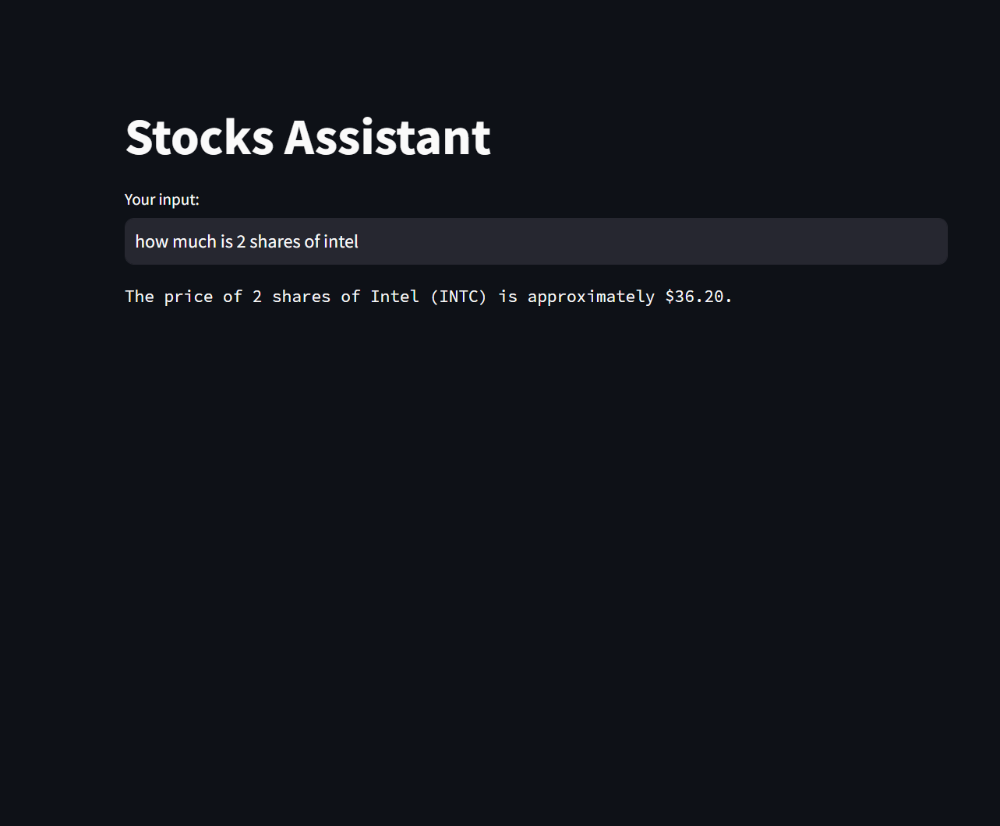
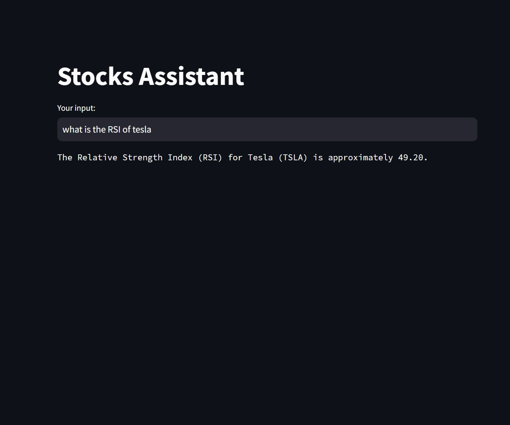

# Stock Assistant
This is an AI chatbot that helps you with the stock market.<br>
Note that this AI can only answer questions about the stock market it's not a general purpose chatbot.<hr>
### <a href="https://shay-stock-assistant.streamlit.app/">Live Website</a> hosted on streamlit
## Packages used:
• <a href="https://pypi.org/project/yfinance/">yfinance</a> by Yahoo, for the stocks API <br>
• <a href="https://pypi.org/project/streamlit/">Streamlit</a> for the website and hosting<br>
• <a href="https://openai.com/">OpenAI</a> for the chatbot API, I used the gpt-3.5-turbo-0613 model<br>
• <a href="https://pypi.org/project/matplotlib/">matplotlib</a> for creating the graphs.
## Features
• Getting the value of any stock/crypto<br>
• Getting a graph for any stock/crypto<br>
• Getting indicators of any stock/crypto, for example:<br>
• Simple Moving Average (SMA),<br>
• Exponential Moving Average (EMA),<br>
• Relative Strength Index (RSI) and MACD <br>
## Examples
### Error message:
<br>
### Get the graph:
<br>
### Get the value of a stock:
<br>
### Get the RSI of a stock(can be done too with SMA, EMA and MACD):
<br>

## Installation:
### If you want to edit the code and create your own chatbot this is how:
### clone the repository:
```
git clone https://github.com/ShayCohenn/Stock-Assistant
```
### cd into the folder
```
cd Stock-Assistant
```
### create your .env.local file with your OpenAI api key like this 
```bash
OPEN_AI_API_KEY = ""
```
### create virtual enviroment
```
python -m virtualenv env
```
### activate the virtualenv
```
.\env\Scripts\activate
```
### install the dependencies
```
pip install -r requirements.txt
```
### run the program
```
streamlit run .\main.py
```